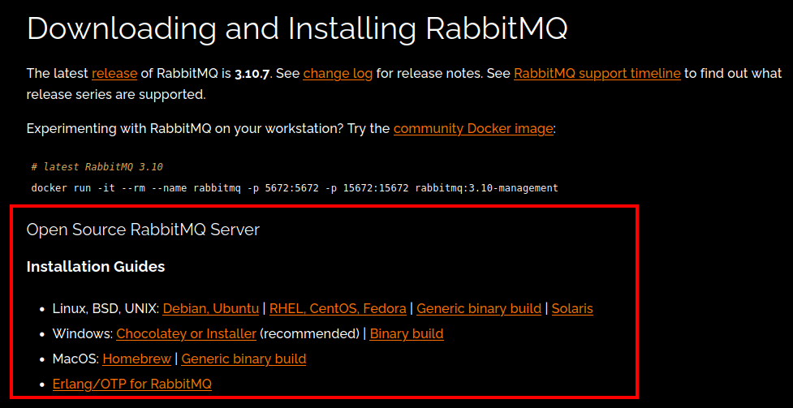

# stablediffusiond

A daemon which watches for messages on RabbitMQ and runs [Stable Diffusion](https://github.com/CompVis/stable-diffusion)

No need to initialize before each query and reduces bloat of other existing solutions.

## Usage

### stablediffusiond service

Starts a Stable Diffusion queue runner
 
- start `sudo systemctl start stablediffusiond.service`
- restart `sudo systemctl restart stablediffusiond.service`
- stop `sudo systemctl stop stablediffusiond.service`

### bin commands

- start stable diffusion queue runner (daemon uses this) `stablediffusion_client`
- send a message to running stable diffusion queue `stablediffusion_client '{"prompt": "cat", "seed": 42}'`

## Installation

Currently `stablediffusiond` depends on a branch which contains classes that mirror the code found in the 
`txt2img` and `img2img` Stable Diffusion scripts. The classes allow us to skip model initialization for each request.

[The three classes can be viewed here](https://github.com/w4ffl35/stable-diffusion/tree/feature/add-classes/classes) (compare to `scripts/txt2img` and `scripts/img2img`):

### Install RabbitMQ

Follow the instructions at [RabbitMQ](https://www.rabbitmq.com/download.html) to install RabbitMQ for your platform



The following instructions assume that you are on Linux and may need to be adapted for your platform

1. `git clone --branch feature/add-classes https://github.com/w4ffl35/stable-diffusion.git`
2. `cd stable-diffusion`
3. Edit the `.git/info/exclude` file and add the following line to the end of the file: `stablediffusiond`
4. `git clone https://github.com/w4ffl35/stablediffusiond.git`
5. Follow Stable Diffusion installation instructions [found in README](https://github.com/w4ffl35/stable-diffusion).
6. ensure you have enabled the conda environment created in step 4, then install pika `pip install pika --upgrade`
7. `cd stablediffusiond`
8. `cp settings.default.py settings.py`, make any changes to the settings file that you wish
9. `sudo ln -s <this_dir>/bin/server.sh /usr/local/bin/stablediffusion_server`
10. `sudo ln -s <this_dir>/bin/client.sh /usr/local/bin/stablediffusion_client`
11. `sudo cp stablediffusiond.service /etc/systemd/system/`
12. `sudo systemctl daemon-reload`
13. `sudo systemctl start stablediffusiond.service`

Your directory structure should look like this:

```
> stable-diffusion
  > [various folders such as `assets`, `classes` and `scripts`]
  > stablediffusiond
    > [various files such as `recieve.py` and `send.py`]
```


## Limitations

- Installation is too manual
- Very basic RabbitMQ configuration
- Not production ready
