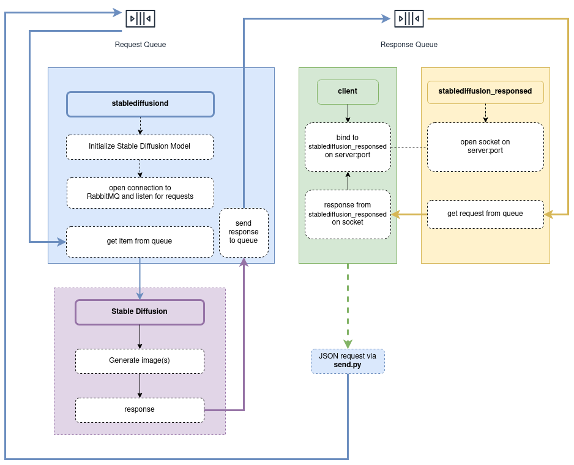

# stablediffusiond

[](https://github.com/w4ffl35/stablediffusiond/actions/workflows/pylint.yml)


---3

A daemon which watches for messages on RabbitMQ and runs [Stable Diffusion](https://github.com/CompVis/stable-diffusion)

- **Daemon** - existing solutions use a webserver, here we use a daemon which is more lightweight
- **No hot loading** - Model stored in RAM (10GB~) for faster processing
- **Less bloat** - code and dependencies have been kept to a minimum
- **Flexibility** - request daemon, response daemon and queue system can be run independently, allowing for more efficient use of resources
- **Easy to use** - just run the daemon and send messages to the queue using `send.py`



1. `stablediffusiond` listens to _request queue_
2. client makes a request which is added to _request queue_
3. `stablediffusiond` gets top item from _request queue_ and runs Stable Diffusion based on request
4. `stablediffusiond` places response from Stable Diffusion into _response queue_
5. `stablediffusion_responsed` service listens to _response queue_ and opens a socket on `localhost:50007`
6. `stablediffusion_responsed` gets top item from _response queue_ and returns it to client connected on `localhost:50007`

---

## Requirements

- RabbitMQ
- Python 3.6+
- conda (optional but recommended)
- pika
- Stable Diffusion and its dependencies
- the Stable Diffusion Model

## Installation

Run the installation script and follow the instructions

1. `curl -s https://raw.githubusercontent.com/w4ffl35/stablediffusiond/master/install.sh | bash`
2. Edit `settings.py` and fill it out with correct values for your environment.

Your directory structure should look like this:

```
> stable-diffusion
  > [various folders such as `assets`, `classes` and `scripts`]
  > stablediffusiond
    > [various files such as `receive.py` and `send.py`]
```

### Manual installation

See [installation script](https://github.com/w4ffl35/stablediffusiond/install.sh) which contains comments for each step

---

## Forked Stable Diffusion

Currently `stablediffusiond` depends on a forked branch which contains classes that mirror the code found in the 
`txt2img` and `img2img` Stable Diffusion scripts. The classes allow us to skip model initialization for each request.

[The three classes can be viewed here](https://github.com/w4ffl35/stable-diffusion/tree/feature/add-classes/classes) (compare to `scripts/txt2img` and `scripts/img2img`):

---

## Commands

### stablediffusiond service

Starts a Stable Diffusion request queue runner
 
- start `sudo systemctl start stablediffusiond.service`
- restart `sudo systemctl restart stablediffusiond.service`
- stop `sudo systemctl stop stablediffusiond.service`


### stablediffusion_responsed service

Starts a Stable Diffusion response queue runner
 
- start `sudo systemctl start stablediffusion_responsed.service`
- restart `sudo systemctl restart stablediffusion_responsed.service`
- stop `sudo systemctl stop stablediffusion_responsed.service`

### bin commands

- send a message to running stable diffusion queue `stablediffusion_client '{"prompt": "cat", "seed": 42}'`

---

## Limitations

- Installation is too manual
- Very basic RabbitMQ configuration
- Not production ready

---

## Bundle instructions

1. pip install -U pyinstaller
2. pyinstaller __init__.py